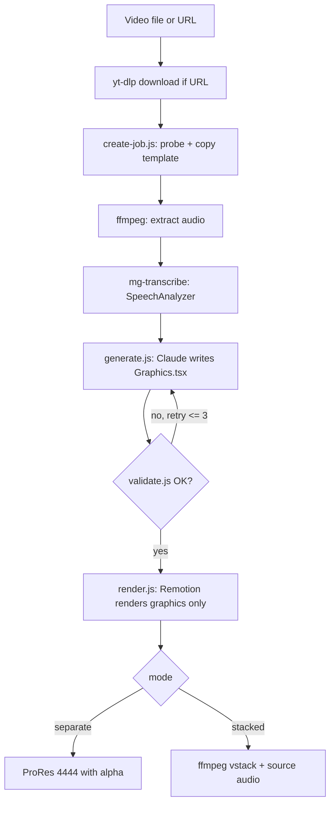

# Motion Graphics

A macOS app that adds AI-designed motion graphics to a video. Drop in a file or paste a link. The app transcribes the video on-device, asks Claude to design a Remotion composition, renders it with a bundled Node runtime, and stitches the result with ffmpeg.

## How it works



## Layout

- `app/` — SwiftUI app (Tuist project). Screens: setup, pick video, direction, working, done.
- `worker/` — Node scripts and the Remotion template. `template/src/Graphics.tsx` is the one file the agent writes. `template/src/library/` holds the pre-built components (Caption, TitleCard, LowerThird, Callout, Highlight, StatCounter, ListReveal, ProgressBar).
- `transcriber/` — SpeechAnalyzer CLI (macOS 26).
- `scripts/bundle-runtimes.sh` — downloads node/ffmpeg/yt-dlp, builds mg-transcribe, and copies the worker into `app/Resources/`.

## Build

1. Run `scripts/bundle-runtimes.sh` once.
2. Run `tuist generate --no-open`.
3. Run `xcodebuild -workspace MotionGraphics.xcworkspace -scheme MotionGraphics -configuration Debug -derivedDataPath build build`.

The app is self-contained (~1.3 GB): Node, ffmpeg, yt-dlp, the headless render browser, and the Claude Code binary all ship inside. First run copies the worker to `~/Library/Application Support/MotionGraphics/` and may download the speech model.

## Test the worker without the app

```sh
cd worker
node create-job.js --source ../jobs/sample.mp4 --mode video-top --job ../jobs/test
ANTHROPIC_API_KEY=sk-... node generate.js --job ../jobs/test --direction "show the key points"
node render.js --job ../jobs/test
```

## Notes

- The API key is stored in the Keychain. Anthropic does not permit third-party apps to use Claude subscription auth, so this uses API billing.
- Remotion 4.x is pinned; 5.0 changes the SSR API signatures.
- yt-dlp self-updates are not wired up yet; re-run `bundle-runtimes.sh` to refresh it.
